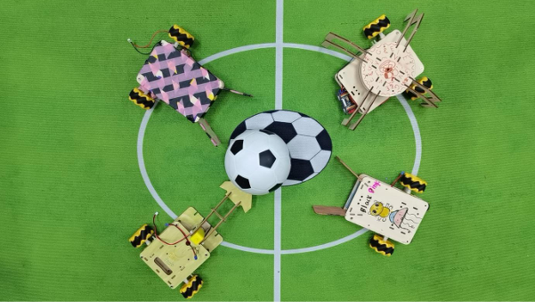
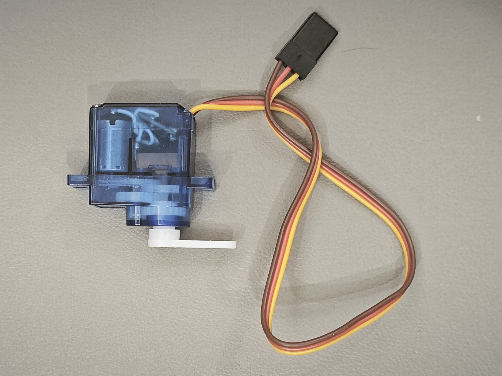

># 第1章 初识机器狗

### 学习目标
- 认识小龟机器狗的整体外形
- 了解机器狗各个部件的名称和功能
- 掌握机器狗的结构组成原理

## 1.1 认识机器狗的外形和部件

### 学习目标
- 认识小龟机器狗的整体外形
- 了解机器狗各个部件的名称和功能
- 掌握机器狗的结构组成原理

### 1.1.1 小龟机器狗外观介绍

同学们，观察放在桌上的机器狗，你们能说一说它的外观吗？它和小狗有什么共同的特点呢？

我们可以用尺子量一量：塑料外壳的长度正好是10厘米，宽度大约是6厘米。站起来时高度相当于两个叠起来的橡皮擦。试着用手掂量，200克的重量比一本书还要轻巧呢！外壳采用磨砂质感的安全塑料，既不会划伤小手，又能保护内部精密零件。

## 1.2 认识机器狗的部件

机器狗可不可爱，想不想动手做一台出来？  
那在我们动手组装机器狗之前，我们要学习机器狗的内部有什么部件，请大家先打开桌上包装盒，依次取出部件。

### 一、机器狗的大脑(主控板介绍)

大家先观察这个黑色的板子，它叫主控板。机器狗和我们人一样，一切行动都要听从大脑的指挥，这块主控板就是机器狗的大脑。我们可以通过手机或者平板电脑给他发送指令，由它给指挥机器够的各部分来完成运动。

我们可以通过编写不同的指令发送给主控板，再选择不同的部件组装用来满足不同的任务。比如老师通过编写指令让机器人摇身一变，让他变成了"足球运动员"。

### 二、机器狗的关节(舵机介绍)

我们刚才观察小龟机器狗有四条腿，你们想知道机器狗的每一条腿是怎样动起来的吗？  
下面拿出像这样的部件，这个是舵机。小龟机器狗有四条腿运动，每条腿由这样一个舵机来驱动。舵机可以输出转动，并带动和它连接的腿一起运动，四个舵机就可以带动四条腿一起运动，从而实现机器狗的各种动作。  

舵机内部还有不少奥妙，透过外壳你们还发现了有哪些部件？  
舵机包含变速齿轮， 一个小马达和电子控制板等。马达提供动力，变速齿轮搭配控制板可以根据编程旋转角度。

### 三、机器狗的动力(电池介绍)

我们平时玩的电动玩具需要安装什么？  
没错是电池，运动需要能量，我们的机器狗也需要电池提供能量。机器狗的能量少了还可以补充，给电池充电，就像我们给手机充电一样。  

### 四、机器狗的血管、神经(导线介绍)

介绍完所有的电子部件，机器狗和小狗一样体内也需要用"血管"传输能量、用"神经"传输信号。  
舵机和电池分别有几根线呢？传输电需要几根线？想一想舵机多出来的一根线是用来干什么的。  
舵机有3根线而电池有两根线，电池只需要传输能量，而舵机还需要从主控板上获取信号所以还需要一根"神经"传输信号。

### 五、机器狗的躯干(外壳介绍)

了解完这些部件，大家观察机器狗，你们能找到这些部件吗？  
这些部件都被安装到了机器狗的躯干里面。  
把部件安装到机器狗的外壳内，再通过导线连接各部分，机器狗就是一个整体了。我们下节课一起来学习安装机器狗。

## 家庭作业与思考题

1.请你画一张机器狗的简笔画，并在图上标出下面这些主要部件：
大脑（主控板）：控制机器狗的所有动作
四条"腿"（舵机）：让机器狗可以动起来
身体（外壳）：保护机器狗内部的零件
心脏（电池）：提供机器狗运动所需的能量
神经（导线）：传递指令，让每个部件协同工作
小提示：图画不需要太精细，重点在于你能用自己的话写出每个部件的作用哦！

2.在下面的选项中，选出机器狗"大脑"对应的部件，并说明理由：
A. 外壳
B. 主控板
C. 电池

3.如果你是一位小小发明家，你会设计机器狗做什么新动作？
请用简短的文字描述你设计的动作（比如跳跃、转圈、挥手等）
并试着画一张示意图，展示机器狗在做这个动作的样子。

4.为什么机器狗需要电池来提供能量？如果没有电池，它还能动吗？
请用自己的语言写下你的想法，并可以和家长或同学讨论这个问题。

5.在家里找找看有没有其他玩具或电子产品（如遥控车、小机器人等），试比较它们和机器狗有什么相似或不同之处。
– 你可以画图或写几句话说明。

## 总结

通过本章的学习，我们认识了机器狗的外形和各个部件，了解了各个部件的名称和功能。这些知识为后续的组装和制作打下了坚实的基础。希望大家在今后的学习和实践中，能够不断探索、勇于动手，发现问题并一起讨论，共同成长！

