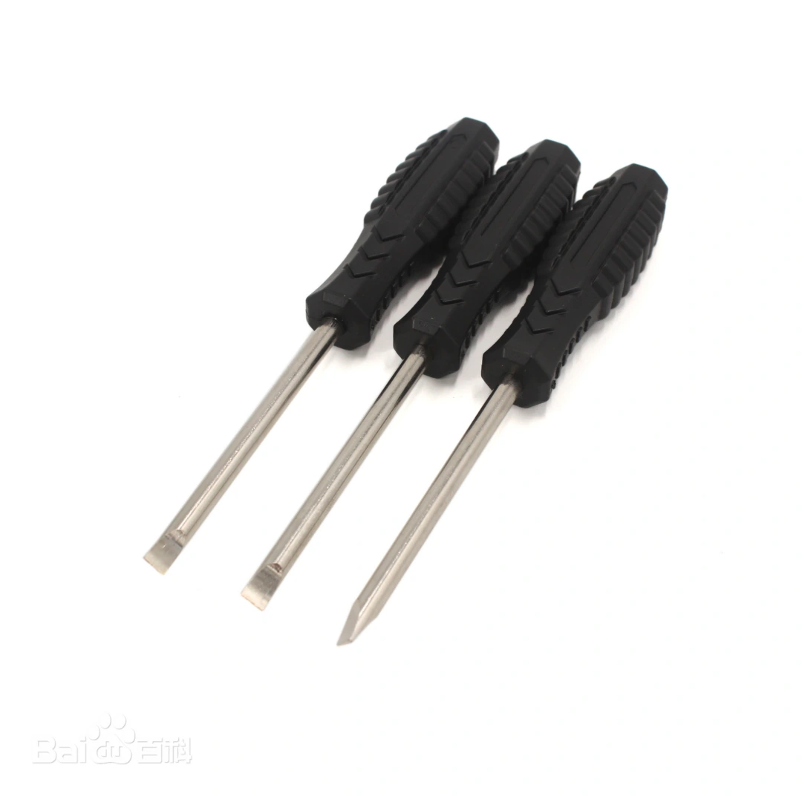
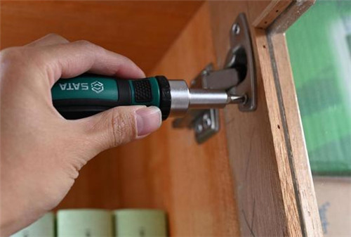
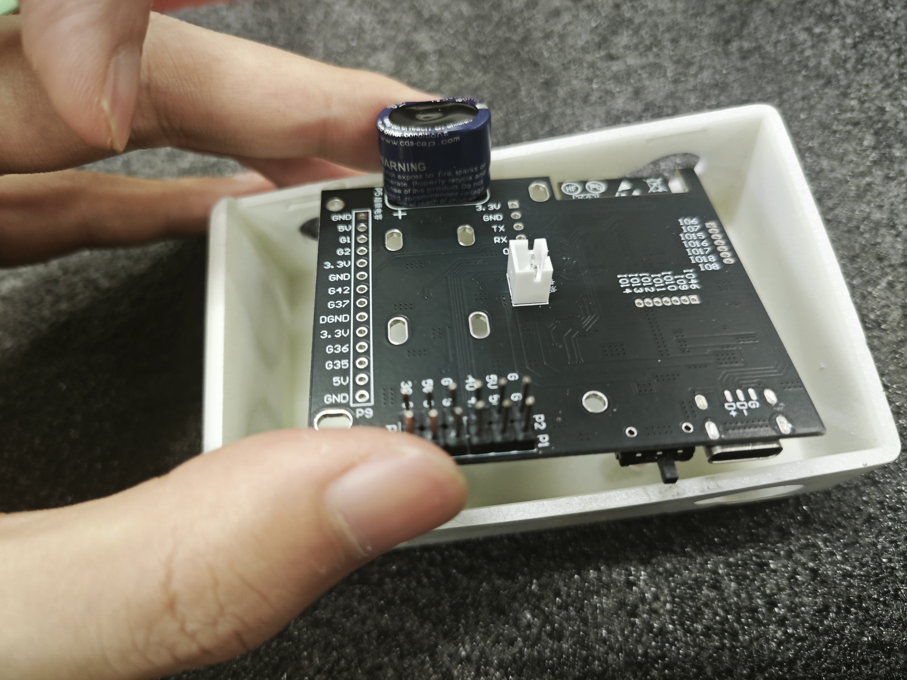
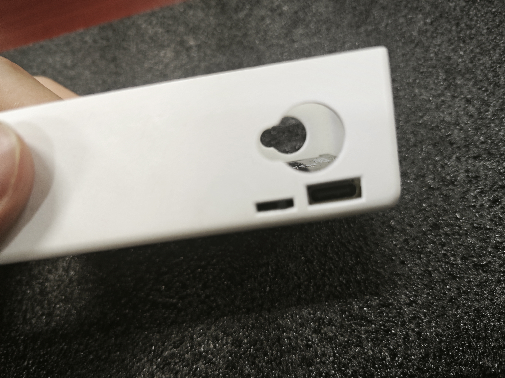
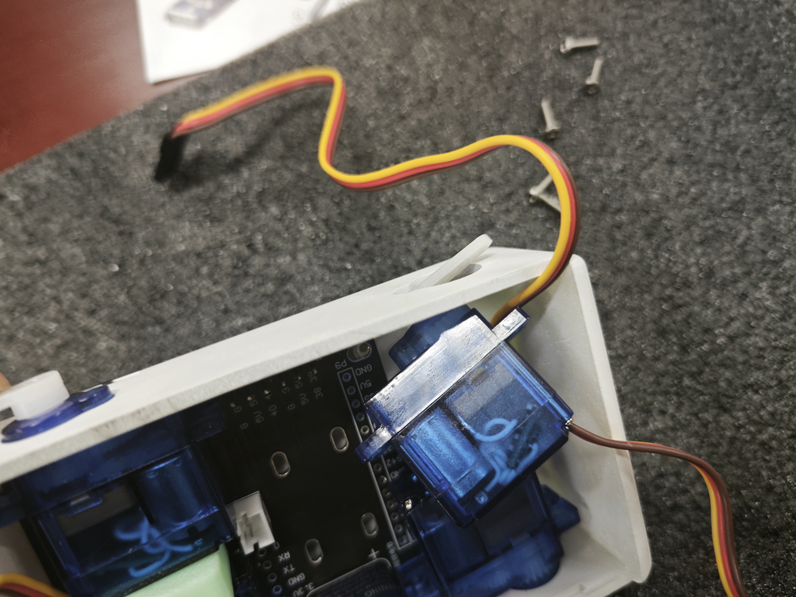
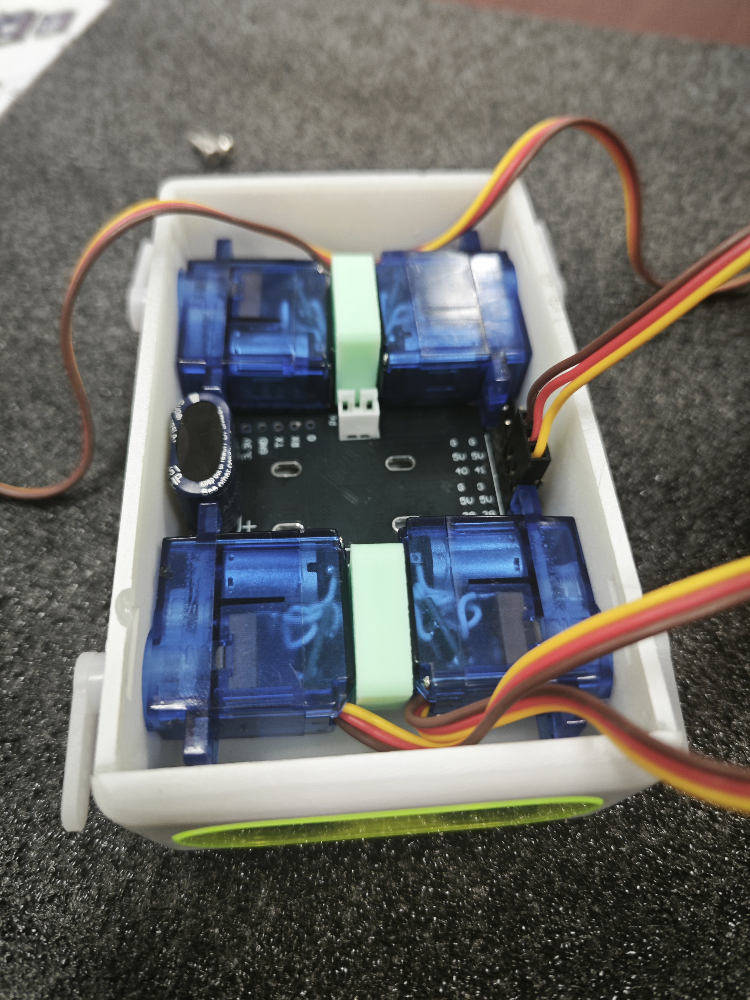
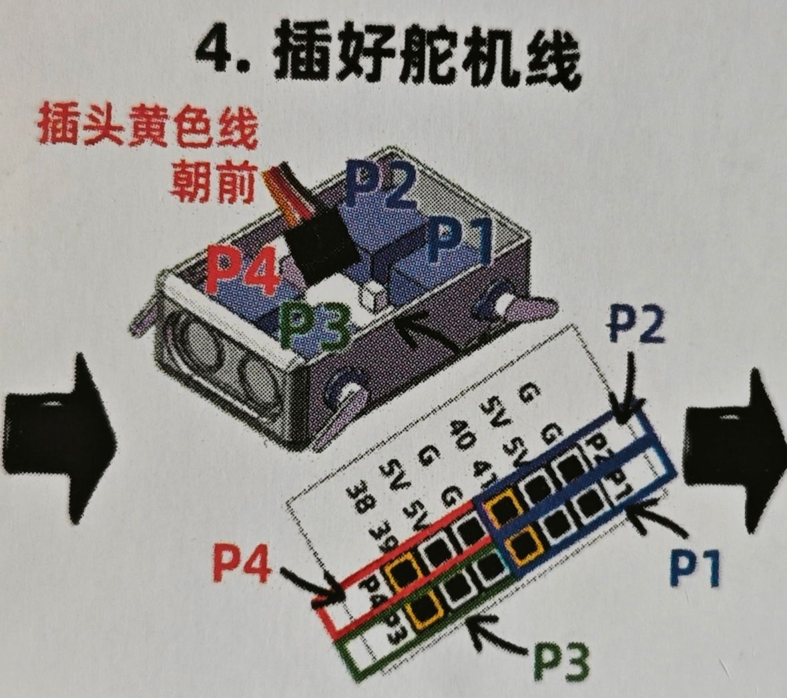
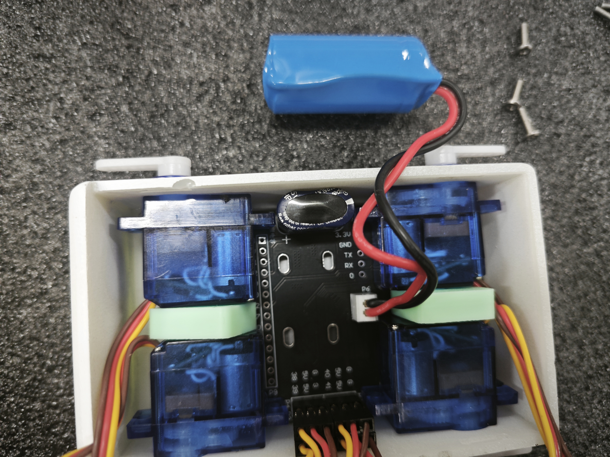
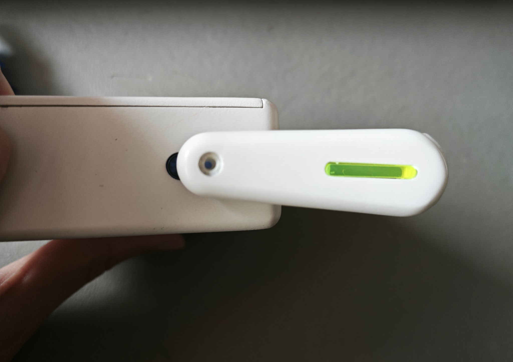

# 第2章 动手制作机器狗

上节课老师带大家认识了机器狗的各个部件，今天老师就带大家组装机器狗。

## 2.1 认识零件和工具(螺丝刀)
我们先来认识一下我们要用到的工具：  
请大家在盒子中找到老师手中的这个工具，有人认识这个工具吗？没错就是螺丝刀。  
### 螺丝刀介绍
螺丝刀，又称螺丝起子，是一种常用的手动工具，用于拧紧或拧松螺丝。

使用螺丝刀时，首先要选择与螺丝头部槽型相匹配的螺丝刀头，常见的槽型包括一字槽、十字槽等。选择合适的刀头可以确保施力均匀，避免损坏螺丝头部。

握持螺丝刀时，手掌要紧握刀柄，食指和拇指控制刀杆，保持稳定。将螺丝刀头垂直对准螺丝头部槽型，轻轻用力向下压，确保刀头完全嵌入槽内。然后，根据拧紧或拧松的方向旋转螺丝刀。  

拧紧螺丝时，通常顺时针旋转；拧松螺丝时，逆时针旋转。旋转时要保持力度均匀，避免用力过猛导致螺丝滑丝或损坏。如果遇到较紧的螺丝，可以适当增加力度，但要注意控制，避免损坏螺丝或螺丝刀。

在操作过程中，要始终保持螺丝刀头与螺丝头部的垂直对齐，确保力量有效传递，提高工作效率。使用完毕后，应将螺丝刀擦拭干净，妥善存放，以便下次使用。

## 2.2 学习组装步骤
认识了工具，我们就可以动手组装机器狗了，在安装之前，请一个小朋友来念一念活动要求：

+ 先听老师讲解安装步骤，再自己动手组装，老师讲到哪一步做到哪一步。
+ 遇到问题及时举手，不允许盲目操作。

### 一、主控板的安装
先拿出我们这一步需要的部件和工具：外壳、主控板、螺丝和螺丝刀。  
外壳朝上，观察外壳底面有什么？  
底面有四个底座，这就是固定我们主控板预留的螺丝孔。

拿出主控板，将有电容的一面朝上。  

将主板的开关和充电口对准盒子一侧的开口，并观察主板预留的螺丝孔和外壳上的螺丝孔有没有对齐。  
主板贴紧盒子底部放入后用短螺丝对角固定。（**注意开关柄能够轻松拨动！**）

### 二、舵机的安装

将舵机对准盒子两侧的孔位由内向外推入。  

依次用上面的方法安装四个舵机，在两个舵机之间放入垫片。

将机器狗的眼睛朝向你自己，按照右上->左上->右下左下->左下的顺序依次插线，注意插头黄色线朝前。

### 三、电池的安装
电池端的防误插接口对准主板电源接口上缺口，向下按压接入。

然后将电池放入中间空当处，收拢电线盖上盒盖。  
(合上盖子的时候注意先插入一侧再稍微用力合上另一侧，如果不能轻松合上，请你检查电线有没有整理到位)

### 四、腿的安装
1、将盒子侧放桌面；  
2、白色摆臂按图示方向轻放到舵机白色输出轴；  

3、保证对齐之后，使用螺丝固定。  
**注意：开机以后不能再用手去转动机器狗的腿！**

### 五、总结
通过今天的组装实践，我们不仅学会了使用螺丝刀等工具，还了解了机器狗各部件在组装中的功能及连接方式。希望大家在未来的学习中能继续保持对动手实践的热情，不断探索和创新！下节课老师带大家学习如何操作机器狗，让大家的机器狗动起来。

## 2.3 课后思考
1. 请画出你心中机器狗组装的步骤图，并标明每一步所使用的工具和部件。
2. 写出你认为安装过程中最关键的一步是什么，并说明理由。
3. 解释为什么需要使用正确的螺丝刀以及如何选择合适的螺丝刀头？
4. 描述机器狗各部件（如主控板、舵机、电池等）在组装中的作用和连接原理。

