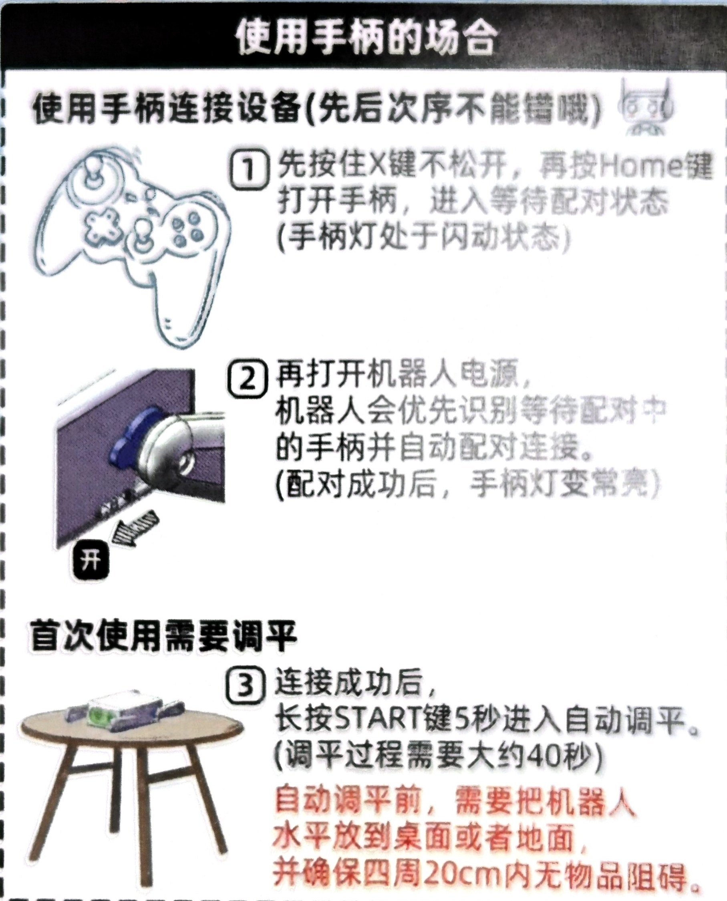
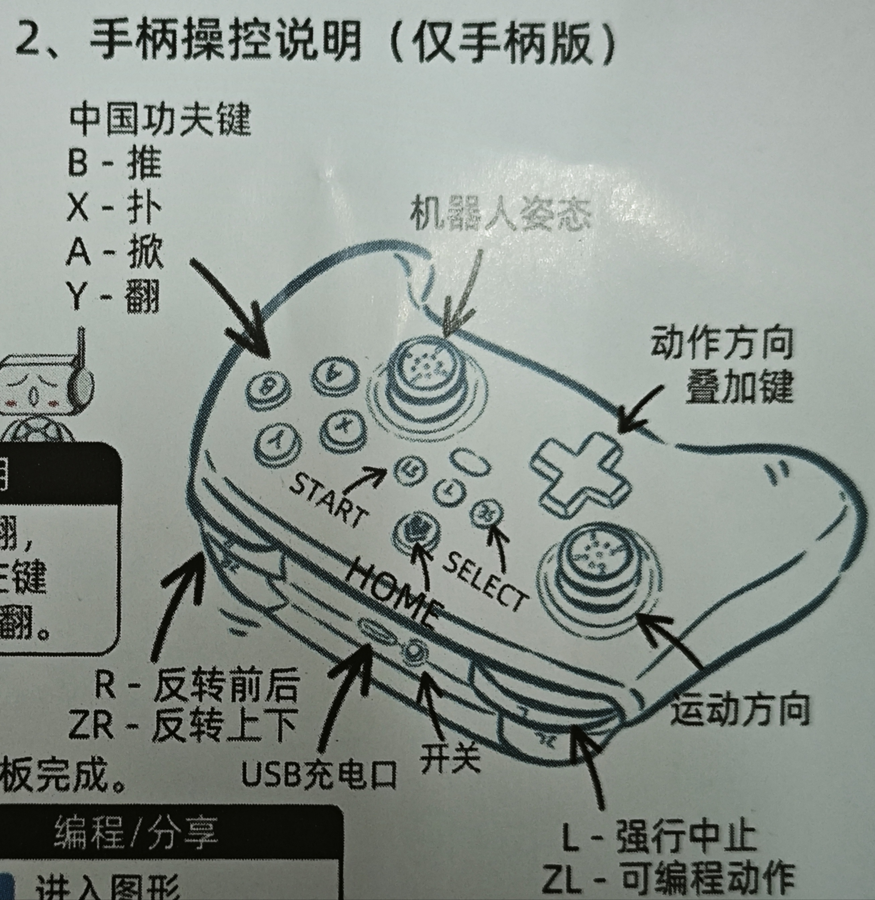

# 第3章 基础控制训练
## 3.1 基本操作入门
上节课我们完成了机器狗的组装，今天我们就来让机器狗动起来，老师今天带大家学习操作机器狗。

<video src="../videos/操作.mp4" controls="controls" width="300" height="500"></video>

### 一、连接手机/平板

1. 机器狗开机发出xiaogui-xxxx的wifi；  
2. 打开手机/平板wlan列表，连接该wifi；  

3. 等待页面自动跳转；  

4. 如果没有自动跳转，手动打开浏览器，输入192.168.4.1。

### 二、准备活动-腿的调平
1. 由首页进入调平

2. 点击开始，等待自动校准完成

3. 如果自动调平无法完成，点击手动校准
4. 通过向上转和向下转按钮将腿调整至与盒子平行
5. 依次完成四条腿的调整
6. 保存，机器狗自动重启
7. 再次连接机器狗的wifi,进入首页后操作

## 3.2 手柄使用方法
这一节课我们主要使用手柄来学习操作流程，大家先拿出手柄按照下面的步骤连接机器狗：

### 熟悉手柄

1. 左滑杆-基础移动
2. 右滑杆-姿态调整
3. 技能键-XYAB
4. 组合键-十字+技能
5. 前后方向变更-R
6. 上下方向变更-ZR
7. 表演动作-ZL
8. 暂停-L

---
尝试按照下面的表格进行操作，记录机器狗的动作。

### 1. 基础移动操作

| 分类     | 动作名称 | 操作方式       | 操作说明                                             |
|----------|----------|----------------|------------------------------------------------------|
| 基础移动 | 前进     | 左摇杆上推     | 将左摇杆推向上方，观察机器狗向前移动                   |
| 基础移动 | 后退     | 左摇杆下推     | 将左摇杆推向下方，记录机器狗如何后退                   |
| 基础移动 | 左转     | 左摇杆左推     | 将左摇杆推向左侧，观察机器狗转向左边                   |
| 基础移动 | 右转     | 左摇杆右推     | 将左摇杆推向右侧，记录机器狗右转效果                   |

思考:机器狗是怎样进行转弯的？

---

### 2. 姿态调整操作

| 分类 | 动作名称 | 操作方式       | 操作说明                                                     |
|------|----------|----------------|--------------------------------------------------------------|
| 姿态 | 站立模式 | 默认           | 未进行操作时机器狗默认处于站立状态                           |
| 姿态 | 仰头模式 | 右摇杆左推     | 按住右摇杆向左推，使机器狗抬头观察外部环境                   |
| 姿态 | 低头模式 | 右摇杆右推     | 按住右摇杆向右推，让机器狗低头，观察地面                       |
| 姿态 | 伏地模式 | 右摇杆下推     | 按住右摇杆向下推，机器狗身体向下，模拟伏地等待动作             |

思考： 当你调整机器狗的姿态时，它的身体是如何改变角度的？

---

### 3. 表演动作操作（按 ZL 触发）

| 分类   | 动作名称 | 操作方式 | 操作说明                                                       |
|--------|----------|----------|----------------------------------------------------------------|
| 表演动作 | 前后     | ZL       | 按 ZL 后观察机器狗做前后摆动                                  |
| 表演动作 | 俯仰     | ZL       | 按 ZL 记录机器狗身体向前或向后弯曲的效果                      |
| 表演动作 | 狗叫     | ZL       | 按 ZL 听声音反馈，记录是否发出类似狗叫的声音                   |
| 表演动作 | 握手     | ZL       | 按 ZL 后观察机器狗前肢是否做出类似握手的动作                     |
| 表演动作 | 弹簧     | ZL       | 按 ZL 记录机器狗是否做出跳跃及弹跳的表现                         |

思考： 在按下 ZL 键后，你觉得机器狗哪一个表演动作最有趣？试试说说看原因。

---

### 4. 基础技能操作

| 分类     | 动作名称   | 操作方式 | 操作说明                                                       |
|----------|------------|----------|----------------------------------------------------------------|
| 基础技能 | 大放手     | A        | 按下 A 键，观察是否触发机器狗放松某部分的动作                   |
| 基础技能 | 大推手     | B        | 按下 B 键，记录机器狗是否做出向前推的动作                         |
| 基础技能 | 飞扑身法   | X        | 按 X 键，观察机器狗是否能快速前扑或改变姿态                       |
| 基础技能 | 前掌翻     | V        | 按 V 键，记录机器狗是否使用前爪做出翻转动作                         |

思考： 你觉得按不同的基础技能键（A、B、X、V）时，机器狗做出的动作有什么不同？

---

### Tips:如何让学生探索并记录操作方式

1. **初步熟悉设备**  
   - 老师先向学生介绍手柄和控制界面上各种按钮（左/右摇杆、十字键、技能键等）的分布和作用，并展示机器狗的基本反应。  
   - 要求学生观察机器狗与手柄操作之间的对应关系。

2. **单独操作测试**  
   - **基础移动**：让学生分别试验左摇杆的四个方向（上、下、左、右），并观察机器狗的运动效果。  
   - **姿态调整**：让学生使用右摇杆测试不同方向（左推、右推、下推），观察机器狗姿态的变化。  
   - 每次操作后，请学生记录下按钮所对应的具体动作，例如按下左摇杆上时记录"前进"。

3. **表演动作验证**  
   - 教师指导学生按下 ZL 键，观察机器狗执行预设的表演动作。（可以多次操作验证，每次操作后让学生用纸笔记录观察结果）
   - 讨论不同操作下是否每次效果一致，并让学生描述他们看到的动作细节。

4. **技能操作练习**  
   - 用单独按键进行基础技能测试（A、B、X、V），同时记录触发动作。  
   - 针对组合技能，分组让学生尝试同时按下十字键及其它技能键（如 A、B、X、Y），记录下机器狗做出动作的过程。  
   - 每完成一次组合操作后，指导学生讨论"为什么同时操作能产生这样的效果"，并填入表格中相应的"操作说明"。

5. **汇总讨论与反馈**  
   - 集体讨论各个操作步骤产生的效果，并由教师整理成统一的操作表格，确保所有记录和实际操作一致。  
   - 鼓励学生对比自己操作的数据并进行修正，如发现不同步骤的差异，大家一同探讨原因。

通过上述步骤，学生不仅能动手操作，还能在实践中总结出每一步对应的操作方式，并最终整理为清晰、统一的操作表格。

---

## 3.3 小挑战-排除险情

通过今天的学习，我们来进行一个有趣的小挑战 —— **"推倒快递盒大作战"**。  
本次挑战不仅考验大家对机器狗控制操作的熟练度，还需要大家发挥团队协作精神，制定合理的操控策略。请各小组按照以下要求进行挑战尝试：

1. **挑战目标**  
   - 用手柄控制机器狗将预先放置在指定区域内的快递盒推倒。  
   - 挑战内容包括：考察操作速度（从起始操作到快递盒倒下所用时间）和推倒效果（快递盒被推倒的高度或距离）。

2. **准备工作**  
   - **练习阶段**：每个小组都有一次练习机会，熟悉手柄的各项操作（如基础移动、姿态调整、表演动作、基础与组合技能）。  
   - **设备检查**：确保机器狗电量充足、连接稳定，并且周围区域没有障碍物，保证安全。  
   - **场地布置**：快递盒放置于地面固定位置，所有操作区域范围内不得有其他杂物。

3. **挑战流程**  
   - **启动信号**：由老师发出"开始"指令后，各小组正式启动操作。  
   - **记录操作**：每组记录下从开始操作到快递盒被推倒的总时间；同时观察并记录快递盒倒下时推出的距离或高度。  
   - **多次尝试**：每组有3次挑战机会，取其中表现最好的成绩作为最终评分依据。

4. **评分标准**  
   - **速度评分**：挑战用时越少，得分越高；  
   - **推倒效果**：快递盒被推倒的距离/高度越大，得分越高；  
   - **操作连贯性**：操作过程中若动作平稳、响应准确，还可获得额外加分。

5. **安全注意事项**  
   - 操作时要严格按照步骤进行，避免急躁操作；  
   - 保证操作区域内同学、家具及其他物品不受干扰，确保安全；  
   - 如遇紧急情况或意外事故，立即停止操作，并通知老师协助处理。

6. **挑战总结与交流**  
   - 挑战结束后，每组分享本次操作过程中的收获和遇到的问题；  
   - 讨论哪一步操作（如基础移动、转向或者姿态调整）在推倒快递盒的过程中最关键，提出改进意见；  
   - 老师会根据各组的表现给予肯定，并公布本次挑战的综合成绩，同时奖励表现优异的小组。

**思考：**  
- 你觉得在推倒快递盒的过程中，哪一步操作最关键？为什么？  
- 在团队协作中，每个成员如何分工，才能让操作更加顺畅？

---

通过这次"小挑战"，希望大家能充分运用今天学到的操控技巧，体验实际操作的乐趣，同时通过思考和讨论，发现不足，进一步提升机器狗的控制水平！

