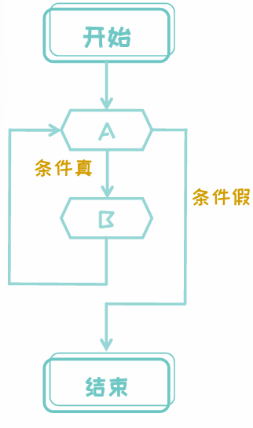
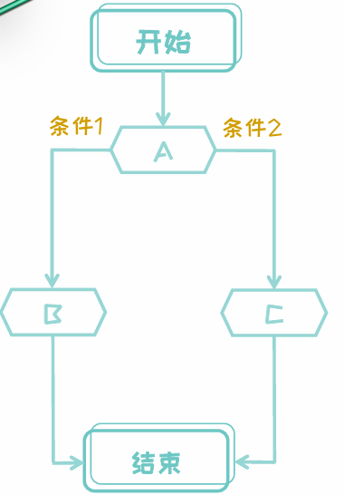
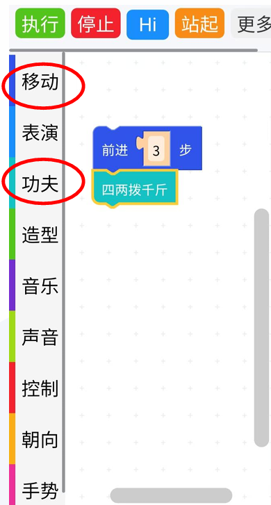

# 第5章 编程基础入门

前两节课老师带大家学习了操作机器狗，大家在操作机器狗完成任务的时候难免遇到困难，有没有方法设定机器狗完成指定任务呢？今天老师就带大家学习简单的编程让机器狗完成指定的任务。

## 5.1 认识程序执行顺序
通过编程我们要让机器狗完成指定的任务，我们在解决问题的时候，会面临遇到复杂的情况，我们编程就是要将复杂的问题根据问题的类型，分解为一系列简单的指令，编写结构化的程序，让机器狗能够按照我们的意愿，一步一步地完成任务。今天老师就带大家学习编程常用的三种结构。

### 一、顺序结构
顺序结构的程序设计是最简单的，只要按照解决问题的顺序写出相应的语句就行，它的执行顺序是自上而下，依次执行。

谁能看图操作机器狗实现下面图中的步骤？

操作后进行活动：

#### 活动一：武术动作顺序操作

**任务要求：**  
1. 根据老师示范的功夫动作顺序操作，设计一套连续的武术动作组合。  
2. 将整个动作组合按"开始—动作1—动作2—动作3—结束"依次排列。  
3. 在执行过程中，每个动作必须严格按照顺序进行，不能倒序。

**示例步骤：**  
- 开始  
- 预备动作（比如：立正、准备姿势）  
- 执行"拨打辅助"动作  
- 接着执行"滚圈后翻"动作  
- 最后执行"滑块大放手"动作  
- 结束

**要求：**  
请同学们绘制一个简单的流程图，标明每一步操作的先后顺序。你可以使用直线连接的框图来表示每一步，流程应清晰、直观。

思考：顺序结构可以完成的任务可以有哪些？顺序结构里面的步骤会执行几次？

### 二、循环结构
循环结构是指在程序中需要反复执行某个功能而设置的一种程序结构。
循环结构包含三个要素：循环变量、循环体和循环终止条件。

操作示范:  
开机->走一步->走三步了吗？没有->走一步->走三步了吗？没有->走一步->走三步了吗？有->停止

---

#### 活动二：简单武术动作循环操作

**任务要求：**  
1. 设计一个简单的循环操作，比如要求机器狗重复做"飞天神腿"或"大冲拳"动作若干次。  
2. 编写控制逻辑，在动作执行次数达到预定值后退出循环。  

**示例逻辑：**  
- 开始  
- 写出循环次数
- 判断是否达到执行次数 
  - 如果"是"，则执行"飞天神腿"动作，并将计数器加一  
  - 如果"否"，则跳出循环  
- 结束

**要求：**  
请同学们绘制一个简单的循环结构流程图，至少包含【条件判断】与【循环体】，并说明什么时候退出循环。

思考：循环结构里面的步骤会执行几次？

---

### 三、选择结构
+ 选择结构先根据条件做出判断，再决定执行执行哪一种操作的决定就是选择结构。

我们会根据遇到的情况，选择不同的方法解决问题。

**任务要求：**  
1. 设计一个简单的避障操作流程，当机器狗在前行过程中遇到障碍时，能够自动判断并采取不同的避障策略（如左转或右转）。  
2. 结合判断结构设计该流程图，确保机器狗能根据实际情况选择相应的路径继续前进。

**示例逻辑：**  
- 开始  
- 检查前方是否有障碍  
  - 如果"有"，则判断左右哪边较安全  
    - 若左侧安全，则执行"左转"  
    - 若右侧安全，则执行"右转"  
  - 如果"没有"，则继续前进  
- 循环检查直至到达终点  
- 结束

**要求：**  
同学们请根据上述步骤绘制一个简单的分支流程图，标明"判断条件"和不同的执行分支（避障策略），并在图中明确表示决策过程。

思考：遇到下一个障碍该怎样操作？再遇到几个呢？

## 5.2 学习顺序结构编程
我们通过了操作机器狗了解了编程结构，我们现在可以动手给机器狗编写程序完成任务了。

### 编写顺序结构程序

1、连接机器狗，打开操作界面，点击图形编程。

2、在侧栏中选择操作。

3、将选择的操作按照活动1中流程图顺序拼接在一起。

4、点击执行。

### 课后思考
- 画出一个简单的顺序结构流程图，例如"开始–前进–停止"，并标出每一步的操作顺序。  
- 写出一段简单的顺序结构程序，设定机器狗往前走9步。
- 用一句话总结编程的作用，它是如何帮助我们分解复杂任务的。  
- 谈谈你认为编程和手工操作最大的不同是什么？
