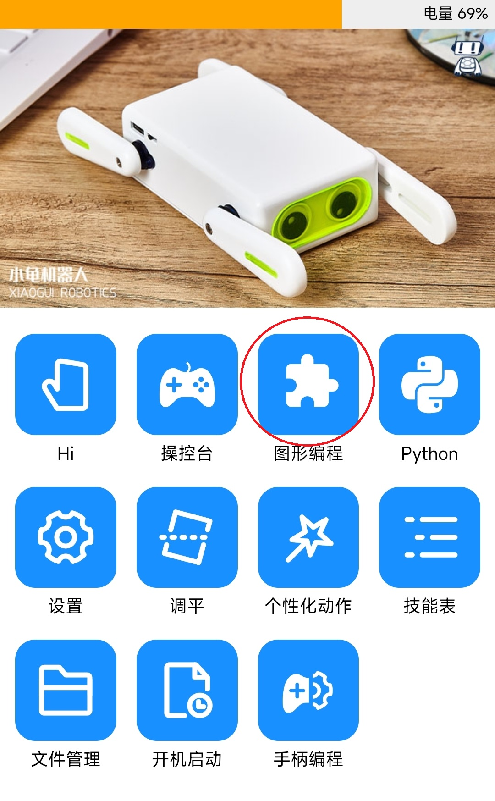
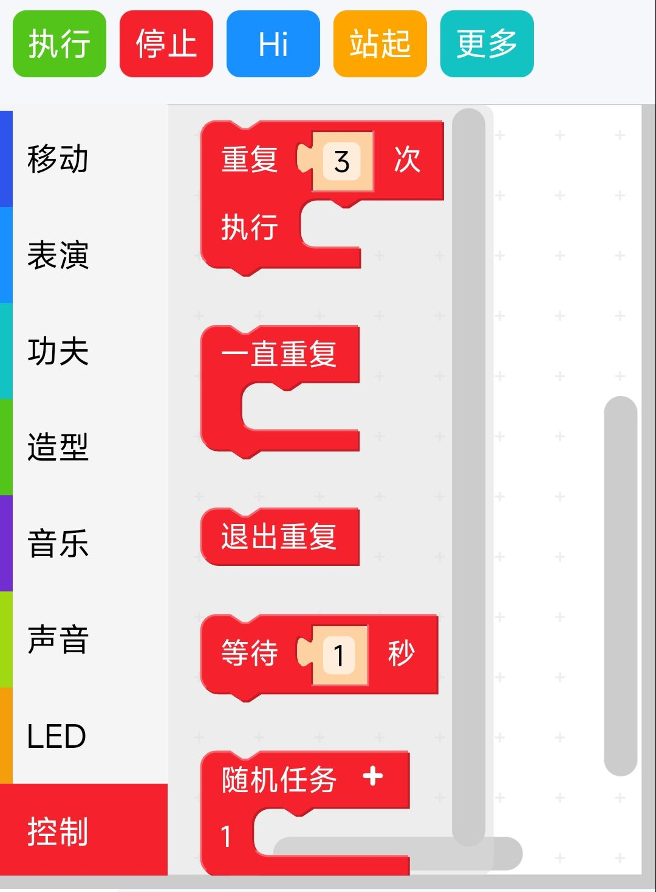
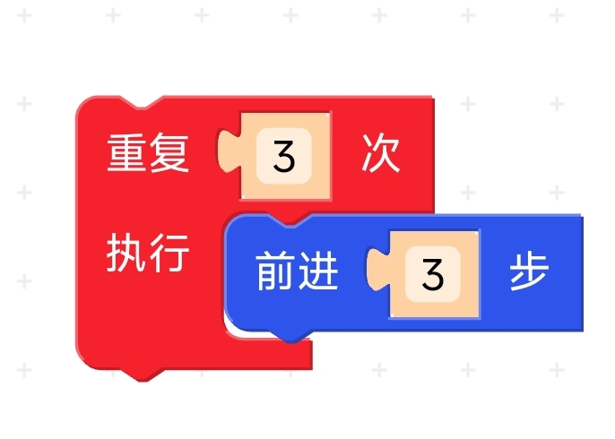

# 第6章 进阶编程开发
上节课我们学习了编程结构和顺序结构编程，这节课我们继续来学习剩下的两种结构编程。

## 6.1 循环结构编程（重复动作）
上节课大家回去编写了让机器人走9步，大家有什么感受呢？

有同学提到了可以用循环结构解决，可以怎样循环呢？可以每次走一步循环9次，也可以每次走三步循环3次，那我们动手实时看吧。

### 编写循环结构程序
1、连接机器狗，打开操作界面，点击图形编程。

2、在侧栏中选择控制，拖出循环模块到编辑区。

3、将选择的操作按照Chapter5活动2中流程图顺序拼接在一起。

4、点击执行。

我们每次循环的动作有几个，如果在循环模块中放入上节课用顺序结构编写的代码，机器狗会怎样移动呢？
我们下面挑战一下自己，比一比谁的机器狗做出的循环动作更有趣。

#### 活动一：循环动作大挑战

**任务要求：**  
利用循环结构编程，让机器狗连续重复做功夫。

**操作步骤：**

1. **连接与设置：**  
   - 连接机器狗并打开操作界面，点击图形编程。  
   - 在侧栏中找到并拖出“循环模块”到编辑区。

2. **编排动作：**  
   - 将功夫命令或移动命令放入循环模块中。  
   - 设置循环次数。

3. **执行检测：**  
   - 点击“执行”，观察机器狗是否按设定的循环次数依次完成动作。  
   - 记录观察结果，并思考循环模块如何帮助机器狗重复操作。

**思考问题：**  
- 机器狗在完成所有循环后是否停下来？  
- 循环结构为重复执行动作带来了哪些方便？

## 6.2 选择结构编程（避障功能）
我们的机器狗是一只听话的小狗，我们可以让他互动，根据上节课的内容来学习选择结构编程让他执行不同的指令。

### 编写选择结构程序
1、连接机器狗，打开操作界面，点击图形编程。

2、在侧栏中选择控制，拖出拍拍手和抬后腿模块到编辑区。

3、将选择的操作按照图中的顺序拼接在一起。

4、点击执行。

#### 活动二：手势指令分支编程训练

**任务要求：**  
设计一个程序，当机器狗接收到不同手势指令时，执行对应的动作。以下手势指令及对应动作如下：  
- **拍拍背**：机器狗用头或身体作出回应。  
- **抬后腿**：机器狗抬起后腿。  
- **抬前腿**：机器狗抬起前腿。  
- **抬左边**：机器狗向左侧倾斜。  
- **抬右边**：机器狗向右侧倾斜。  
- **翻过来**：机器狗翻转身体。

**操作步骤：**

1. **连接与设置：**  
   - 连接机器狗并打开操作界面，进入图形编程模式。  
   - 在侧栏中选择“控制”模块，将分支（选择结构）模块拖入到编辑区。

2. **设计手势判断：**  
   - 设置条件判断模块，每个条件分支检测一种手势信号，如“拍拍背”、“抬后腿”、“抬前腿”、“抬左边”、“抬右边”以及“翻过来”。  
   - 在每个分支中拖入相应的动作模块，确保机器狗执行对应动作。

3. **组装程序：**  
   - 按照手势检测的逻辑将各个分支依次排列，构成完整的分支选择结构。  
   - 检查各个流程是否正确连接，然后保存程序。

4. **测试运行：**  
   - 点击“执行”，依次通过手势传感器或教师示范发出各个手势。  
   - 观察机器狗是否按设计分别执行对应的动作，并记录实验结果。

**思考问题：**  
- 当多个手势同时出现时，该如何优先判断并执行？  
- 你认为手势指令在日常互动中能为机器狗带来哪些有趣的应用？

## 6.3 总结
我们通过认识机器狗、组装机器狗、操作机器狗学习了基本编程思想和简易程序编写，通过实践活动深入探讨了循环和选择结构在机器狗控制中的应用。利用循环结构，机器狗能够重复执行预设动作，而选择结构使其能根据手势指令做出判断和响应。通过动手编程，同学们不仅巩固了编程基础，还锻炼了逻辑思维与问题解决能力。期望大家在不断实践中，进一步将这些编程理念应用于更多创新场景。
